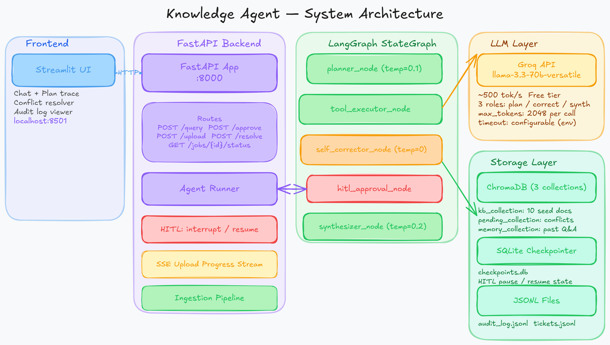
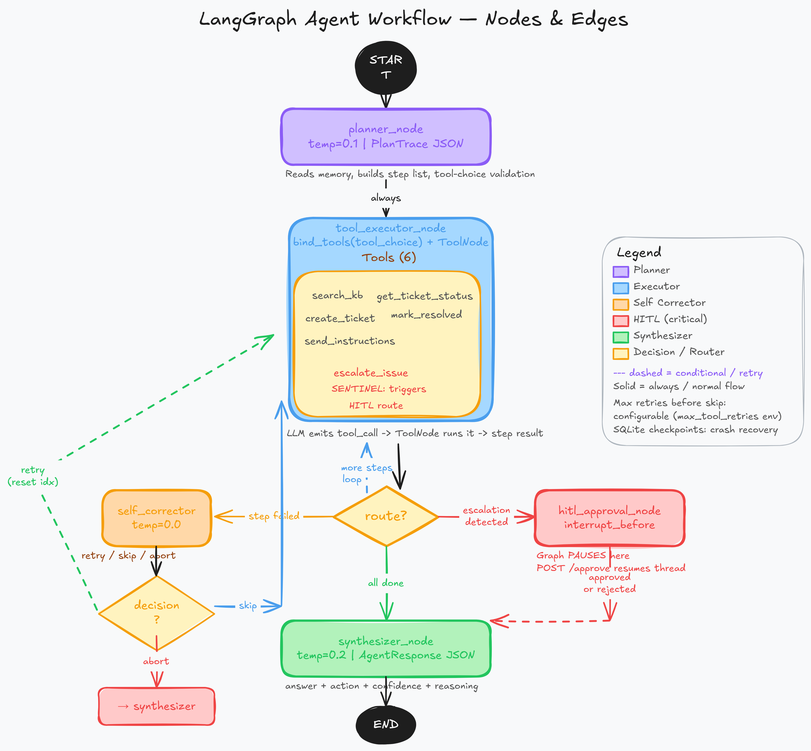
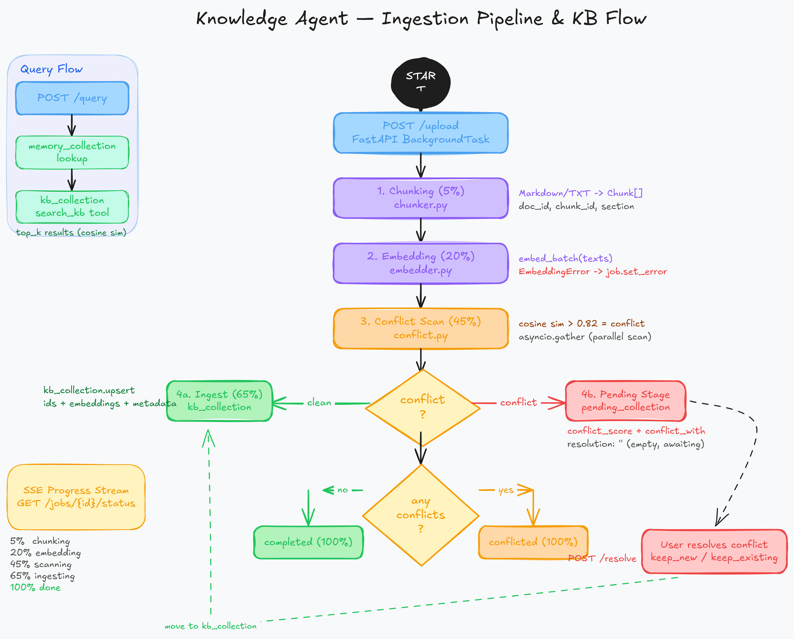

<div align="center">

# 🤖 Autonomous Knowledge Execution Agent

**A self-correcting, plan-and-execute AI agent for IT Helpdesk — with human-in-the-loop escalation, long-term memory, and conflict-aware knowledge base expansion.**

[](https://python.org)
[](https://github.com/langchain-ai/langgraph)
[](https://groq.com)
[](https://fastapi.tiangolo.com)
[](https://trychroma.com)
[](https://streamlit.io)
[](LICENSE)

</div>

---

## Table of Contents

- [Overview](#overview)
- [System Architecture](#system-architecture)
- [Tech Stack](#tech-stack)
- [Features](#features)
- [Agent Workflow](#agent-workflow)
- [Tools Reference](#tools-reference)
- [Human-in-the-Loop (HITL)](#human-in-the-loop-hitl)
- [Document Ingestion Pipeline](#document-ingestion-pipeline)
- [Conflict Handling](#conflict-handling)
- [API Reference](#api-reference)
- [Setup & Installation](#setup--installation)
- [Project Structure](#project-structure)
- [Design Decisions](#design-decisions)
- [Limitations](#limitations)
- [What I'd Do Differently](#what-id-do-differently-with-more-time)

---

## Overview

The **Autonomous Knowledge Execution Agent** is a production-grade agentic AI system built for an IT Helpdesk domain. A user submits a natural language goal — a troubleshooting query, an incident report, a policy question — and the agent:

1. **Plans** a typed, multi-step tool-use sequence before touching anything
2. **Executes** each step deterministically via LangGraph's `ToolNode`
3. **Self-corrects** on failure (retry with new input / skip / abort)
4. **Pauses** for human approval before executing irreversible P1 escalations
5. **Synthesizes** a structured final response with answer, action, and confidence

Every action is written to an append-only audit log. The knowledge base can be expanded dynamically — new documents are scanned for semantic conflicts before going live.

### Sample Queries

```
"How do I set up VPN on macOS?"
"My VPN keeps disconnecting every 10 minutes."
"I forgot my password and my account is locked."
"What software am I allowed to install without approval?"
"We've had a company-wide network outage for the past 30 minutes."   ← triggers P1 escalation + HITL
"What do I need to do on my first day?"
"How do I set up my email on my phone?"
```

---

## System Architecture

> End-to-end view: user request → API → LangGraph agent → storage layer



The system is split into three layers:

| Layer | Component | Responsibility |
|---|---|---|
| **Frontend** | Streamlit (`:8501`) | Chat, plan trace viewer, conflict resolution UI, audit log |
| **Backend** | FastAPI (`:8000`) | REST routes, HITL state, background ingestion, SSE streaming |
| **Agent** | LangGraph `StateGraph` | 5-node reasoning loop with conditional routing and checkpointing |

**Storage:**
- **ChromaDB** — 3 isolated collections: `kb_collection`, `pending_collection`, `memory_collection`
- **SQLite** (`checkpoints/checkpoints.db`) — LangGraph checkpointer; persists HITL pause state
- **JSONL files** — `audit_log.jsonl`, `tickets.jsonl` — crash-safe append-only logs

---

## Tech Stack

| Layer | Technology | Why |
|---|---|---|
| **Agent Framework** | LangGraph | StateGraph with conditional edges, checkpointing, and `interrupt_before` HITL |
| **LLM Provider** | Groq — `llama-3.3-70b-versatile` | ~500 tok/s free tier; 3 distinct roles at different temperatures |
| **LLM Client** | `langchain-groq`, `langchain-core` | Tool binding, message construction, async invocation |
| **Vector Store** | ChromaDB (3 collections) | KB chunks, pending conflicts, long-term memory — kept isolated |
| **Backend API** | FastAPI + Uvicorn | REST, `BackgroundTask`, SSE, lifespan events |
| **Frontend** | Streamlit | Chat UI, plan trace, conflict resolver, audit viewer |
| **State Persistence** | SQLite (`checkpoints/checkpoints.db`) | LangGraph checkpoint store — HITL pause/resume without Redis |
| **Audit / Tickets** | Append-only JSONL | Simple, crash-safe, human-readable logs |
| **Async I/O** | `aiofiles` | Non-blocking file writes for escalation + audit records |
| **Dependency Mgmt** | `uv` | Fast Python packaging |

---

## Features

### Core

| Feature | Implementation |
|---|---|
| Natural language goal input | `POST /query` — plain text, no schema required |
| Visible planning trace | `planner_node` produces `PlanTrace` with typed steps **before** any execution |
| Tool use (6 tools) | `search_kb`, `create_ticket`, `escalate_issue`, `mark_resolved`, `send_instructions`, `get_ticket_status` |
| Self-correction on failure | `self_corrector_node` — LLM decides retry (new input) / skip / abort at `temp=0.0` |
| Structured output | `AgentResponse` JSON — plan, answer, action, confidence, step counts |

### Bonus

| Feature | Implementation |
|---|---|
| Human-in-the-Loop | `interrupt_before=["hitl_approval"]` — graph pauses; resumes via `POST /approve` |
| Long-term memory | `memory_collection` in ChromaDB — past Q&A retrieved by planner as context |
| Append-only audit log | `audit_log.jsonl` — every tool execution recorded; served via `GET /audit-log` |
| Parallel tool actions | `asyncio.gather()` in dispatcher |
| Conflict-aware doc upload | chunk → embed → parallel conflict scan → user resolution |
| Real-time upload progress | SSE stream on `GET /jobs/{job_id}/status` — 5 stage milestones |
| Crash recovery | SQLite checkpointer — in-flight graph state survives process restart |

---

## Agent Workflow

> LangGraph `StateGraph` — 5 nodes, 2 conditional routers, 1 HITL interrupt point



### The 5 Nodes

#### `planner_node` — `temp=0.1`

Reads the user's `goal` and up to 3 prior Q&A pairs from `memory_collection`. Asks the LLM to output a JSON `PlanTrace` — a list of typed steps, each naming one tool and its exact input string. Invalid tool names are filtered out; empty plans fall back to a single `search_kb` step.

```python
# PlanTrace shape
{
  "reasoning": "why I chose this plan",
  "steps": [
    { "step_number": 1, "tool": "search_kb", "tool_input": "VPN macOS setup" },
    { "step_number": 2, "tool": "send_instructions", "tool_input": "..." }
  ]
}
```

#### `tool_executor_node` — `temp=0.2`

Force-binds the LLM to call exactly the planned tool via `llm.bind_tools(ALL_TOOLS, tool_choice=step.tool)`. The LLM emits a `tool_call` message; LangChain's `ToolNode` intercepts and runs the function. On success: marks step `done`. On exception: marks step `failed`.

#### `self_corrector_node` — `temp=0.0`

Called when the previous step has `status=failed`. Sends goal + tool + input + error + retry count to the LLM. Returns one of:

| Decision | Effect |
|---|---|
| `retry` | Increment `step.retries`, apply new `tool_input`, re-run the same step |
| `skip` | Mark step `skipped`, advance to next step |
| `abort` | Set `should_abort=True`, jump to synthesizer with an error |

If retries exceed `MAX_TOOL_RETRIES`, the step is auto-skipped regardless of LLM decision.

#### `hitl_approval_node`

The graph **never actually enters this node on its own** — `interrupt_before=["hitl_approval"]` freezes state in SQLite before the node runs. Resumed only by `POST /approve`. Approved → writes `ESC-XXXXXX` to `tickets.jsonl`. Rejected → cancellation message, no action.

#### `synthesizer_node` — `temp=0.2`

Reads all `step_results` and `errors` from state. Checks for the `ESCALATION_REQUESTED::` sentinel first (fast-path to pending-approval response). Otherwise asks the LLM to produce a final `AgentResponse` JSON.

```python
# AgentResponse shape
{
  "answer":     "Here are the steps...",
  "action":     "send_instructions",
  "confidence": 0.91,
  "reasoning":  "Found 3 relevant KB chunks..."
}
```

### Routing Logic

```
After tool_executor:
  step.status == "failed"          → self_corrector
  result starts with "ESCALATION_REQUESTED::"  → hitl_approval  (graph PAUSES)
  current_step >= len(plan.steps)  → synthesizer
  else                             → tool_executor  (loop)

After self_corrector:
  decision == "retry"   → tool_executor  (same step, new input)
  decision == "skip"    → tool_executor  (next step)
  decision == "abort"   → synthesizer
```

---

## Tools Reference

All tools are decorated with `@tool` and registered in `ALL_TOOLS`. The planner names them; the executor force-binds them.

| Tool | Purpose | Returns | Notes |
|---|---|---|---|
| `search_kb` | Semantic search over the IT knowledge base | Top-k chunks with title, section, relevance score | Uses `asyncio.new_event_loop()` workaround (ToolNode is sync-first) |
| `create_ticket` | Creates a support ticket for hands-on IT intervention | `TKT-XXXXXX` confirmation | Writes to `tickets.jsonl`; priority defaults to `medium` |
| `escalate_issue` | Flags P1/P2 critical incidents for human approval | Sentinel: `ESCALATION_REQUESTED::<reason>` | **Does not execute** the escalation — sentinel triggers the HITL route |
| `mark_resolved` | Marks informational queries as resolved | `Resolved: <summary>` | Used for fully self-service queries |
| `send_instructions` | Formats step-by-step instructions | `INSTRUCTIONS::<text>` | Synthesizer parses sentinel to format final answer |
| `get_ticket_status` | Looks up ticket status by ID | Status string or not-found | Reads `tickets.jsonl` line-by-line |

> **Planner constraint:** `search_kb` must be the **first** step whenever knowledge retrieval is needed. `escalate_issue` is reserved for genuine P1/P2 incidents only — the system prompt enforces both rules.

---

## Human-in-the-Loop (HITL)

> The mechanism that prevents the agent from autonomously executing irreversible, high-impact actions.

### How It Works

```
escalate_issue tool runs
        │
        ▼
Returns "ESCALATION_REQUESTED::<reason>"
        │
        ▼
_route_after_executor detects sentinel
        │
        ▼
Routes to hitl_approval node
        │
        ▼  ← interrupt_before fires here
Graph PAUSES — state flushed to checkpoints.db
        │
        ▼
Synthesizer returns action_result.status = "pending_approval"
User sees: "Escalation pending your approval"
        │
        ▼
POST /approve {"session_id": "...", "approved": true}
        │
        ▼
graph.ainvoke(None, config={"configurable": {"thread_id": session_id}})
        │
        ▼
hitl_approval_node runs
  ├── approved=true  → writes ESC-XXXXXX to tickets.jsonl → "escalated"
  └── approved=false → "Escalation cancelled. No action taken."
        │
        ▼
       END
```

### Approve / Reject

```bash
# Approve
curl -X POST http://localhost:8000/approve \
  -H "Content-Type: application/json" \
  -d '{"session_id": "<uuid>", "approved": true, "approved_by": "admin"}'

# Reject
curl -X POST http://localhost:8000/approve \
  -H "Content-Type: application/json" \
  -d '{"session_id": "<uuid>", "approved": false}'
```

> **Why SQLite and not Redis?** For a single-process deployment, SQLite is sufficient. `interrupt_before` pauses the graph; `ainvoke(None, thread_id=...)` resumes exactly where it stopped. Redis would only be needed for multi-worker horizontal scaling.

---

## Document Ingestion Pipeline

> New documents enter via `POST /upload` → `BackgroundTask` → 5-stage async pipeline



### Pipeline Stages

| Stage | Progress | What Happens |
|---|---|---|
| **Chunking** | 5% | `chunk_file(path)` → `Chunk[]` with `doc_id`, `chunk_id`, `section`, `text` |
| **Embedding** | 20% | `embed_batch(texts)` → `float[][]` — one vector per chunk |
| **Conflict Scan** | 45% | `detect_conflicts()` — parallel cosine similarity scan via `asyncio.gather()` |
| **Ingest / Stage** | 65% | Clean chunks → `kb_collection.upsert()` live immediately; conflict chunks → `pending_collection` |
| **Finalise** | 100% | `status = "completed"` or `"conflicted"` depending on conflict count |

### Three ChromaDB Collections

| Collection | Contents | Access |
|---|---|---|
| `kb_collection` | 10 seed docs + verified uploaded chunks | Queried by `search_kb` tool |
| `pending_collection` | Conflict-staged upload chunks | Reviewed and resolved by human via `POST /resolve` |
| `memory_collection` | Past user Q&A pairs | Retrieved by planner as conversational prior context |

> Collections are kept **strictly separate** — mixing them would contaminate retrieval scores and risk serving contradictory information.

### Seeding the Knowledge Base

```bash
# Run once after first setup
uv run python scripts/ingest.py
```

Embeds all 10 markdown files in `data/kb/` into `kb_collection`.

---

## Conflict Handling

When a new document is uploaded, each chunk is compared against every existing KB chunk using cosine similarity. A chunk is flagged as a **conflict** when similarity exceeds the threshold — semantically close enough to describe the same topic but with potentially contradictory content.

### Detection Threshold

```env
CONFLICT_THRESHOLD=0.82   # configurable in .env
```

Cosine distance `d` maps to similarity `1 - d/2`. At `0.82` the chunks are close enough to be about the same procedure but may disagree on the steps. Below `0.82` they are topically related but not conflicting.

### Resolution Flow

```
New chunk has conflict_score > 0.82
        │
        ▼
Stored in pending_collection with:
  conflict_with: <existing_chunk_id>
  conflict_score: 0.87
  conflict_summary: "..."
  resolution: ""   ← empty until resolved
        │
        ▼
Upload job → status: "conflicted"
Streamlit surfaces conflict to user
        │
        ▼
POST /resolve
{
  "upload_id": "...",
  "resolutions": [
    { "pending_chunk_id": "...", "decision": "keep_new" }
    { "pending_chunk_id": "...", "decision": "keep_existing" }
  ]
}
        │
  keep_new → replace existing KB chunk, promote pending to kb_collection
  keep_existing → discard pending chunk
```

> **Non-conflicting chunks go live immediately.** A 10-chunk document might have 8 chunks ingest live and 2 enter the pending queue — partial ingestion is intentional and correct.

---

## API Reference

Base URL: `http://localhost:8000` &nbsp;|&nbsp; Interactive docs: [`/docs`](http://localhost:8000/docs)

| Method | Endpoint | Description | Body |
|---|---|---|---|
| `POST` | `/query` | Submit a natural language goal | `{"goal": "...", "session_id": "..."}` |
| `POST` | `/approve` | Approve or reject a pending HITL escalation | `{"session_id": "...", "approved": true, "approved_by": "..."}` |
| `POST` | `/upload` | Upload a new document to the knowledge base | `multipart/form-data` |
| `GET` | `/jobs/{job_id}/status` | SSE stream — real-time upload pipeline progress | Path param: `job_id` |
| `POST` | `/resolve` | Resolve document upload conflicts | `{"upload_id": "...", "resolutions": [...]}` |
| `GET` | `/audit-log` | Paginated audit log of all agent actions | Query: `page`, `page_size` |
| `GET` | `/health` | Health check | — |
| `GET` | `/docs` | Interactive Swagger UI | — |

### `POST /query` — Response Shape

```json
{
  "session_id": "550e8400-e29b-41d4-a716-446655440000",
  "goal": "How do I set up VPN on macOS?",
  "plan": {
    "reasoning": "User needs VPN setup steps — search KB first, then send instructions.",
    "steps": [
      { "step_number": 1, "tool": "search_kb",         "status": "done",   "result": "..." },
      { "step_number": 2, "tool": "send_instructions",  "status": "done",   "result": "INSTRUCTIONS::..." }
    ]
  },
  "answer":     "Here are the steps to configure VPN on macOS...",
  "action":     "send_instructions",
  "confidence": 0.91,
  "action_result": { "status": "executed", "output": { "answer": "..." } }
}
```

---

## Setup & Installation

### Prerequisites

- Python 3.11+
- [`uv`](https://docs.astral.sh/uv/) package manager
- Free Groq API key from [console.groq.com](https://console.groq.com)

### Step 1 — Clone and configure

```bash
git clone https://github.com/Veds22/knowledge-agent
cd knowledge-agent
cp .env.example .env
```

Edit `.env`:

```env
GROQ_API_KEY=gsk_your_key_here

# Optional tuning (these are the defaults)
MAX_PLAN_STEPS=5
MAX_TOOL_RETRIES=2
MAX_GRAPH_ITERATIONS=20
TOP_K=5
CONFLICT_THRESHOLD=0.82
LLM_TIMEOUT_SECONDS=30

# Optional log location (defaults to ./logs/knowledge-agent.log)
LOGS_DIR=./logs
LOG_FILE_PATH=./logs/knowledge-agent.log
```

### Step 2 — Install dependencies

```bash
uv sync
```

### Step 3 — Seed the knowledge base

```bash
uv run python scripts/ingest.py
```

Run **once** — embeds the 10 seed IT helpdesk markdown files in `data/kb/` into ChromaDB.

### Step 4 — Start the backend

```bash
uv run uvicorn src.api.main:app --reload --host 0.0.0.0 --port 8000
```

### Step 5 — Start the frontend

```bash
uv run streamlit run frontend/app.py
```

Open **[http://localhost:8501](http://localhost:8501)**

### Environment Variables Reference

| Variable | Default | Description |
|---|---|---|
| `GROQ_API_KEY` | — | **Required.** Groq API key |
| `MAX_PLAN_STEPS` | `5` | Maximum steps the planner can produce |
| `MAX_TOOL_RETRIES` | `2` | Per-step retry limit before auto-skip |
| `MAX_GRAPH_ITERATIONS` | `20` | LangGraph recursion limit guard |
| `TOP_K` | `5` | KB chunks returned per `search_kb` call |
| `CONFLICT_THRESHOLD` | `0.82` | Cosine similarity above which a chunk is flagged |
| `LLM_TIMEOUT_SECONDS` | `30` | Per-LLM-call timeout |

---

## Project Structure

```
knowledge-agent/
├── data/
│   └── kb/                       # 10 seed IT helpdesk markdown files
├── diagrams/                     # Architecture and workflow diagrams
│   ├── architecture-diagram.png
│   ├── grpah-agent-flow.png
│   └── ingestion-pipeline.png
├── scripts/
│   └── ingest.py                 # One-time KB seeding script
├── frontend/
│   └── app.py                    # Streamlit UI
├── src/
│   ├── core/
│   │   ├── config.py             # Settings (pydantic-settings, env vars)
│   │   ├── schemas.py            # AgentState, PlanTrace, PlanStep, ActionResult…
│   │   ├── logger.py             # Structured logging config
│   │   ├── job_store.py          # In-memory async job tracker for uploads
│   │   └── checkpointer.py      # SQLite LangGraph checkpointer factory
│   ├── graph/
│   │   ├── state.py              # AgentState TypedDict
│   │   ├── tools.py              # @tool definitions (6 tools)
│   │   ├── nodes.py              # All 5 node functions + system prompts
│   │   └── graph.py              # StateGraph build + compile + conditional edges
│   ├── agent/
│   │   ├── memory.py             # Memory retrieval from memory_collection
│   │   └── runner.py             # Graph entry point: ainvoke wrapper
│   ├── actions/
│   │   └── register.py           # Side-effect action handlers
│   ├── ingestion/
│   │   ├── chunker.py            # Markdown/TXT → Chunk[]
│   │   ├── embedder.py           # embed_single / embed_batch
│   │   ├── conflict.py           # detect_conflicts() with asyncio.gather
│   │   └── pipeline.py           # Full async pipeline orchestrator
│   └── api/
│       ├── main.py               # FastAPI app, lifespan, CORS
│       ├── routes.py             # All route handlers
│       └── deps.py               # Dependency injection (DB, runner…)
├── chroma_db/                    # ChromaDB persistent storage (auto-created)
├── checkpoints/                  # LangGraph SQLite checkpoints (auto-created)
│   └── checkpoints.db
├── audit_log.jsonl               # Append-only action audit trail
├── tickets.jsonl                 # Support tickets and escalation records
├── .env.example
└── pyproject.toml
```

---

## Design Decisions

**LangGraph over raw async loops**
A hand-rolled retry loop would need to replicate state machines, crash recovery, and HITL pause/resume from scratch. LangGraph provides all three as first-class primitives — conditional edges for routing, a checkpointer for persistence, `interrupt_before` for HITL. The graph is also node-level testable.

**Groq free tier for all LLM calls**
`llama-3.3-70b-versatile` at ~500 tok/s handles three distinct roles (planner at `temp=0.1`, corrector at `temp=0.0`, synthesizer at `temp=0.2`) without hitting rate limits for demo traffic. Single provider = simpler config.

**SQLite checkpointer, not Redis**
For a single-process deployment, SQLite is sufficient. `interrupt_before` pauses the graph; `ainvoke(None, thread_id=...)` resumes exactly where it stopped. Redis would only be necessary for multi-worker horizontal scaling.

**Three isolated ChromaDB collections**
`kb_collection` (verified KB), `pending_collection` (conflict-staged uploads), `memory_collection` (past Q&A). Isolation prevents unresolved conflicts from contaminating retrieval and conversational memory from polluting KB search scores.

**Conflict threshold at 0.82**
Cosine similarity above 0.82 indicates chunks describe the same procedure with potentially contradictory instructions. Below 0.82 they are topically related but not genuinely conflicting. Tunable via `CONFLICT_THRESHOLD` in `.env`.

**Sentinel strings for HITL triggering**
`escalate_issue` returns `ESCALATION_REQUESTED::<reason>` rather than a separate state flag. The router inspects the step result directly — self-describing, no separate channel between tool execution and graph routing.

---

## Limitations

| Limitation | Root Cause | Workaround / Fix |
|---|---|---|
| Uncalibrated confidence scores | `synthesizer_node` generates confidence via LLM, not statistical calibration | Treat as relative signal only; fix with Platt scaling |
| `search_kb` sync workaround | LangChain `ToolNode` is sync-first; `embed_single` is async | Uses `asyncio.new_event_loop()` inside tool; fix with async-native ToolNode |
| No authentication | All API endpoints are open | Add OAuth2/API key middleware before production use |
| Session ID collision | Sessions sharing `session_id` share LangGraph checkpoint state | Generate per-request UUIDs; enforce uniqueness in route handler |
| Markdown / TXT ingestion only | Chunker only parses plain text formats | Add `pypdf2` and `python-docx` parsers to the ingestion pipeline |
| In-memory `JobStore` | Upload job state lost on process restart | Replace with SQLite- or Redis-backed job store |

---

## What I'd Do Differently With More Time

- **Stream tokens to the frontend via SSE** — replace per-node Groq calls with a single streaming response piped to Streamlit
- **Typed routing with calibrated probabilities** — replace LLM-JSON routing with structured `Choice` outputs at conditional edges
- **pytest coverage** — unit tests per node with mock LLM responses; integration tests for the full graph with checkpointing
- **Docker Compose** — containerise FastAPI + Streamlit + ChromaDB volume for one-command local deployment
- **PDF / DOCX ingestion** — extend the chunker to handle binary document formats
- **Redis checkpointer** — enable multi-worker horizontal scaling for the agent graph
- **Confidence calibration** — post-hoc Platt scaling layer on synthesizer output

---

<div align="center">

Built by [Vedant Srivastava](https://github.com/Veds22) &nbsp;·&nbsp; [linkedin.com/in/vedant-srivastava-b21472291](https://linkedin.com/in/vedant-srivastava-b21472291)

</div>